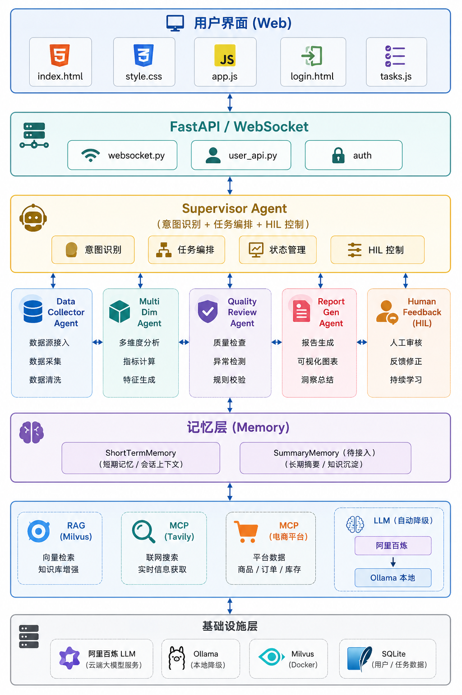
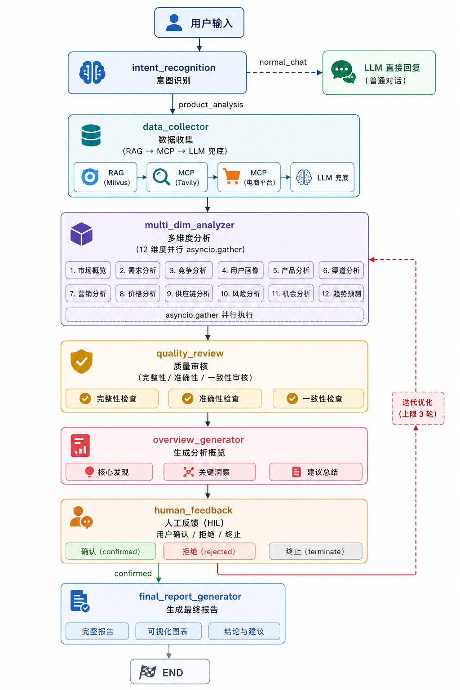

# 🧠 商品分析 Agent

> **多 Agent 商品分析系统** — 基于 LangGraph Supervisor 模式，从小红书、抖音、淘宝、亚马逊、得物等多平台采集数据，进行 12 维度分析，生成结构化报告（Markdown/PDF）。

---

## 核心能力

| 能力 | 说明 |
|------|------|
| **意图识别** | LLM 自动区分"商品分析请求"与"普通对话" |
| **多源数据采集** | RAG（Milvus 混合检索）+ Tavily 网络检索 + LLM 兜底生成 |
| **12 维分析** | 爆款/配色/价格带/品类/材质/风格/人群/购买动机/痛点/使用场景/购买路径/生命周期 |
| **并行分析** | 12 个维度通过 `asyncio.gather` 并行调用 LLM，秒级完成 |
| **报告生成** | 固定模板的 Markdown 报告，支持 PDF 导出 |
| **Human-in-the-Loop** | 生成概览 → 用户确认/反馈 → 迭代改进 → 输出终稿 |
| **流式输出** | LLM 推理结果逐 token 推送到前端，实时展示 |
| **记忆管理** | 短期记忆（滑动窗口 20 轮）+ 摘要记忆（LLM 自动总结，待启用） |
| **用户认证** | 注册/登录 + JWT 令牌，分析任务与用户绑定 |
| **任务管理** | 任务列表、状态跟踪、报告下载、删除 |
| **LLM 降级** | 阿里百炼额度不足时自动降级到本地 Ollama 模型 |
| **暗色模式** | 前端支持毛玻璃 UI + 主题切换 |

---

## 架构设计

### 系统架构



### Agent 工作流



---

## 快速开始

### 环境要求

- Python >= 3.11
- Milvus（可选，Docker 部署）
- 阿里百炼 API Key（可选，有 Ollama 时可降级运行）
- Tavily API Key（可选，推荐）
- Ollama（可选，阿里百炼降级方案）

### 安装

```bash
# 1. 克隆项目
git clone <repo-url> && cd cross-agent

# 2. 创建虚拟环境
python -m venv .venv && source .venv/bin/activate

# 3. 安装依赖
pip install -r requirements.txt

# 4. 配置环境变量
cp .env.example .env
# 编辑 .env，填入必要的 API Key
```

### 启动

**方式一：阿里百炼（主后端）**
```bash
# 确保 .env 中已配置 DASHSCOPE_API_KEY
uvicorn app.main:app --host 0.0.0.0 --port 8000 --reload
```

**方式二：仅使用本地 Ollama（无需 API Key）**
```bash
# 提前启动 Ollama 并拉取模型
ollama pull qwen3:8b
ollama pull nomic-embed-text

# 修改 .env 清空 DASHSCOPE_API_KEY 即可触发降级
uvicorn app.main:app --host 0.0.0.0 --port 8000 --reload
```

访问 **http://localhost:8000**

---

## 配置说明

### 环境变量（`.env`）

```bash
# === 阿里百炼（主后端，与 Ollama 二选一或共存）===
DASHSCOPE_API_KEY=sk-xxxxxxxxxxxx
DASHSCOPE_BASE_URL=https://dashscope.aliyuncs.com/compatible-mode/v1

# === Tavily 网络搜索（推荐）===
TAVILY_API_KEY=tvly-xxxxxxxxxxxx

# === Milvus 向量数据库（可选）===
MILVUS_HOST=localhost
MILVUS_PORT=19530

# === Ollama 本地模型（降级方案）===
# 当阿里百炼额度不足或未配置时自动降级
# OLLAMA_BASE_URL=http://localhost:11434/v1      # 默认值
# OLLAMA_MODEL=qwen3:8b                          # 对话模型
# OLLAMA_EMBEDDING_MODEL=nomic-embed-text        # 向量模型

# === 用户认证 / JWT ===
JWT_SECRET_KEY=your-secret-key-here              # 生产环境务必修改
JWT_EXPIRE_HOURS=24

# === 服务配置 ===
APP_HOST=0.0.0.0
APP_PORT=8000
```

### LLM 模型配置（`app/config.py`）

| 用途 | 阿里百炼（默认） | Ollama（降级） |
|------|------------------|----------------|
| 意图识别 | `qwen-plus` | `qwen3:8b` |
| 数据分析 | `qwen-max` | `qwen3:8b` |
| 报告生成 | `qwen-max` | `qwen3:8b` |
| 文本向量化 | `text-embedding-v3` | `nomic-embed-text` |
| 摘要记忆 | `qwen-plus` | `qwen3:8b` |

### LLM 降级机制

当阿里百炼返回额度不足（HTTP 402/429）错误时，客户端自动切换为 Ollama 本地模型：

```
阿里百炼 ──正常──→ 使用云端付费模型
     │ 额度不足
     └──────→ Ollama 本地模型（自动降级，后续请求不再重试百炼）
```

切换后日志会输出警告 `阿里百炼额度不足，降级到本地 Ollama 模型`，所有后续请求（对话、流式、向量化）均走 Ollama。

---

## 使用指南

### 用户认证

首次使用需注册账号，登录后分析任务会自动绑定到当前用户，可在右侧"我的任务"面板查看历史任务和下载报告。

未登录用户只能进行普通对话，无法发起商品分析。

### 分析商品

在输入框输入分析请求，例如：

```
男性衬衫爆款分析
运动鞋2025年流行趋势与配色
夏季女装价格带与风格
母婴用品购买动机分析
```

### 分析流程

1. **输入请求** → 输入商品分析需求
2. **意图识别** → 系统自动判断是否为分析请求
3. **数据采集** → 从 RAG、Tavily、LLM 多渠道采集
4. **并行分析** → 12 维度同时分析（侧边栏实时显示进度）
5. **概览确认** → 侧边栏展示分析概览（Flexbox 布局，按钮始终可见）
6. **确认/反馈** → 确认则生成报告，拒绝可输入改进建议（最多 3 轮迭代）
7. **下载报告** → Markdown / PDF 格式下载

### WebSocket 协议

```json
// 客户端 → 服务端
{"type": "user_message", "content": "男式衬衫爆款分析"}
{"type": "decision", "action": "confirm|reject|terminate", "feedback": "..."}

// 服务端 → 客户端
{"type": "token", "content": "正在..."}              // 流式 token
{"type": "done", "intent": "product_analysis"}      // 流式结束
{"type": "status", "content": "正在采集..."}         // 状态提示
{"type": "overview", "data": {...}}                 // 分析概览
{"type": "report_ready", "url": "..."}              // 报告就绪
{"type": "task_status", "task_id": "...", ...}      // 任务状态更新
{"type": "task_list", "tasks": [...]}               // 任务列表
{"type": "error", "content": "..."}                 // 错误
{"type": "terminated", "content": "..."}            // 终止
```

---

## 项目结构

```
cross-agent/
├── app/
│   ├── main.py               # FastAPI 入口 + 静态文件服务
│   ├── config.py             # 全局配置（环境变量加载）
│   ├── logger.py             # 统一日志配置
│   │
│   ├── auth/                 # 用户认证
│   │   └── __init__.py       # JWT 签发/验证 · bcrypt 密码哈希 · 注册/登录
│   │
│   ├── models/               # 数据模型
│   │   ├── enums.py          # 平台/维度/时间/状态 枚举
│   │   ├── schemas.py        # Pydantic 模型（Product, AnalysisParams 等）
│   │   └── state.py          # AgentState TypedDict
│   │
│   ├── llm/                  # LLM 客户端（自动降级）
│   │   └── client.py         # LLMClient：统一 chat/stream/embed，百炼→Ollama 降级
│   │
│   ├── memory/               # 记忆系统
│   │   ├── short_term.py     # 短期记忆（滑动窗口 20 轮）
│   │   └── summary_memory.py # 摘要记忆（LLM 自动总结，待接入）
│   │
│   ├── mcp/                  # 数据采集层
│   │   ├── base.py           # MCP 基类 + ProductResult 数据模型
│   │   ├── tavily.py         # Tavily 网络检索 + LLM 兜底
│   │   └── factory.py        # 工厂模式，并行采集
│   │
│   ├── rag/                  # RAG 检索
│   │   ├── milvus_client.py  # Milvus 连接/建集合/检索
│   │   ├── embedding.py      # 文本向量化
│   │   └── hybrid_search.py  # Query Rewrite → 向量检索
│   │
│   ├── agent/                # Agent 核心
│   │   ├── prompts.py        # 所有 LLM Prompt 模板
│   │   ├── graph.py          # LangGraph 图编排
│   │   └── nodes/            # 7 个 Agent 节点
│   │       ├── intent_recognition.py
│   │       ├── data_collector.py
│   │       ├── analyzer.py        # 12 维并行分析
│   │       ├── quality_review.py
│   │       ├── overview_generator.py
│   │       ├── report_generator.py
│   │       └── human_feedback.py
│   │
│   ├── api/                  # API 端点
│   │   ├── websocket.py      # WebSocket 实时通信
│   │   └── user_api.py       # 用户 REST API（注册/登录/任务 CRUD）
│   │
│   ├── task/                 # 任务管理
│   │   └── manager.py        # SQLite 任务 CRUD
│   │
│   └── report/               # 报告生成
│       └── generator.py      # Markdown/PDF 生成
│
├── static/                   # 前端静态文件
│   ├── index.html            # 主页面
│   ├── login.html            # 登录/注册页
│   ├── style.css             # 样式（毛玻璃 + 暗色模式 + 响应式）
│   ├── app.js                # WebSocket 客户端
│   └── tasks.js              # 任务列表组件 + 认证 UI
│
├── docs/
│   ├── 技术方案文档.md        # 完整技术设计
│   └── 需求优化计划.md        # 后续优化路线图
│
├── data/                     # SQLite 数据库（自动生成）
│   ├── auth.db               # 用户认证库
│   └── tasks.db              # 任务管理库
│
├── reports/                  # 报告输出目录（自动生成）
├── .env.example              # 环境变量模板
├── pyproject.toml            # 依赖管理
└── README.md
```

---

## 依赖清单

| 包 | 版本 | 用途 |
|----|------|------|
| fastapi | >=0.111.0 | Web 框架 |
| uvicorn | >=0.29.0 | ASGI 服务器 |
| websockets | >=12.0 | WebSocket 支持 |
| openai | >=1.30.0 | LLM 客户端（百炼 + Ollama OpenAI 兼容 API） |
| httpx | — | Ollama 原生 API 调用（transitive） |
| langgraph | >=0.2.0 | Agent 图编排 |
| langchain | >=0.3.0 | LangChain 生态 |
| pymilvus | >=2.4.0 | Milvus 向量数据库 |
| tavily | >=0.3.0 | 网络搜索 |
| sentence-transformers | >=3.0.0 | 文本向量化（可选） |
| weasyprint | >=62.0 | HTML → PDF 转换 |
| pydantic-settings | >=2.2.0 | 环境变量加载 |
| aiofiles | >=23.0.0 | 异步文件操作 |
| bcrypt | >=4.1.0 | 密码哈希 |
| pyjwt | >=2.8.0 | JWT 令牌 |

---

## 开发计划

| 阶段 | 任务 | 状态 |
|------|------|------|
| **P0** | 项目骨架 + 配置管理 | ✅ |
| **P0** | 数据模型定义 | ✅ |
| **P0** | LLM 客户端（流式 + 降级） | ✅ |
| **P0** | LangGraph 图 + Supervisor 编排 | ✅ |
| **P0** | 数据采集（RAG + MCP + LLM） | ✅ |
| **P0** | 12 维度并行分析 | ✅ |
| **P0** | 质量审核 | ✅ |
| **P0** | 概览生成 + HIL 流程 | ✅ |
| **P0** | 最终报告生成 | ✅ |
| **P0** | WebSocket 实时通信 | ✅ |
| **P0** | 前端 UI（毛玻璃 + 暗色模式） | ✅ |
| **P1** | 记忆系统（短期记忆已接入） | ✅ |
| **P1** | Markdown/PDF 报告导出 | ✅ |
| **P1** | 用户认证 + 任务管理 | ✅ |
| **P1** | LLM 降级（百炼 → Ollama） | ✅ |
| **P2** | 摘要记忆接入 | ⬜ |
| **P2** | Milvus 初始化 + 数据导入 | ⬜ |
| **P2** | 各电商平台 MCP 对接 | ⬜ |
| **P2** | 报告嵌入图片（图表 + 商品图） | ⬜ |
| **P2** | OSS 文件上传 | ⬜ |
| **P3** | 跨会话长期记忆 | ⬜ |
| **P3** | 测试覆盖 | ⬜ |

---

## 相关文档

- [技术方案文档](docs/技术方案文档.md) — 完整的技术架构设计
- [需求优化计划](docs/需求优化计划.md) — 后续功能优化路线图

---

## License

MIT
